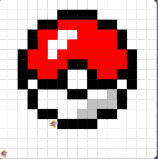

# Unit 1 - Asphalt Art

## Introduction

Cities use asphalt art to improve public safety, inspire their residents and visitors, and brighten communities. Your goal is to create asphalt art to revitalize The Neighborhood and bring the community together with the help of the Painter.

## Requirements

Use your knowledge of object-oriented programming, algorithms, the problem solving process, and decomposition strategies to create asphalt art:
- **Create a new subclass** – Create at least one new subclass of the PainterPlus class that is used for a component of the asphalt art design.
- **Plan an algorithm** – Use the problem solving process and decomposition strategies to plan an algorithm that incorporates a combination of sequencing, selection, and/or iteration.
- **Write a method** – Write at least one method in a PainterPlus subclass that contributes to a component of the asphalt art design.
- **Document your code** – Use comments to explain the purpose of the methods and code segments.

## Notes: Neighborhood & Painter Class

This project was created on Code.org's JavaLab platform using the built in Neightborhood GUI output. To test and edit this project you must build in Code.org's JavaLab with the Neighborhood GUI enabled. For reference to the Painter class documentation, [you can read more here.](https://studio.code.org/docs/ide/javalab/classes/Painter)

## Output:

< Put sketch / Final image here >
 

## Reflection

1. Describe your project.

   - For my project, I made a pokemon ball. I chose this because it seemed pretty simple to do and I also enjoyed watching pokemon when I was younger, so I thought it would be fun to try making it as an art.

2. What are two things about your project that you are proud of?

   - One thing about my project that I am most proud of would be adding in the extra designs in the pokemon ball to make it look a little less plain. Another thing I am proud about is creating this art by writing down the whole the code for it on my own.

3. Describe something you would improve or do differently if you had an opportunity to change something about your project.

   - One thing that I would have done differently if I had an opportunity to change something about my project would be making this with different colors and style since there are more colorful pokemon balls that look cooler and better.